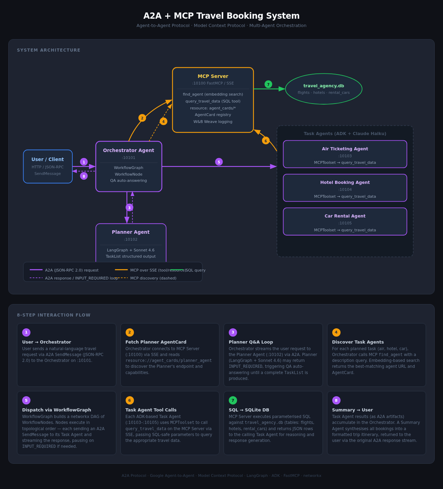

# A2A with MCP as Registry

Demonstrates how to use [Model Context Protocol (MCP)](https://modelcontextprotocol.io/) as a dynamic agent registry, enabling [A2A](https://google.github.io/A2A/) agents to discover and communicate with each other at runtime.

A travel planning scenario is used: a user request flows through an orchestrator that plans, discovers, and delegates to specialized booking agents.

## Architecture



| Notebook | Role | Port |
|---|---|---|
| `mcp_server.ipynb` | MCP registry: agent discovery via embeddings, travel SQL tools | 10100 |
| `orchestrator_agent.ipynb` | Coordinates planner + travel agents, generates final summary | 10101 |
| `planner_agent.ipynb` | LangGraph agent: decomposes user request into a task list | 10102 |
| `travel_agents.ipynb` | Three ADK agents: air ticketing, hotel booking, car rental | 10103–10105 |
| `client.ipynb` | Interactive A2A client — run this last | — |

## Prerequisites

- Python 3.13, [uv](https://github.com/astral-sh/uv)
- A `.env` file with required API keys (see `.env.sample`)

```sh
uv sync
source .venv/bin/activate
```

## Running

Launch JupyterLab, then run each notebook **top-to-bottom** in this order:

```sh
uv run --with jupyter jupyter lab
```

1. **`mcp_server.ipynb`** — start the MCP server first; all other notebooks depend on it
2. **`planner_agent.ipynb`** — start the planner agent
3. **`travel_agents.ipynb`** — starts all three travel agents in a single notebook
4. **`orchestrator_agent.ipynb`** — start the orchestrator last among the servers
5. **`client.ipynb`** — run this to send a trip-planning request and drive the conversation

Each notebook's final cell starts the server and blocks — open separate JupyterLab tabs or use the kernel for each.

## Disclaimer

This sample is for demonstration purposes. Treat all data from external agents as untrusted input — sanitize before using in LLM prompts to prevent prompt injection attacks.
